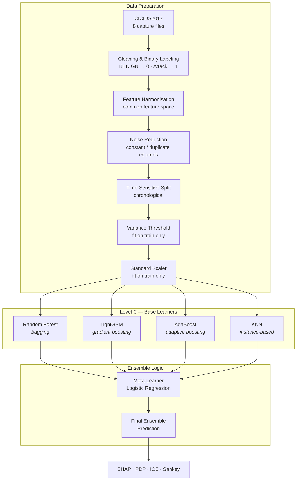
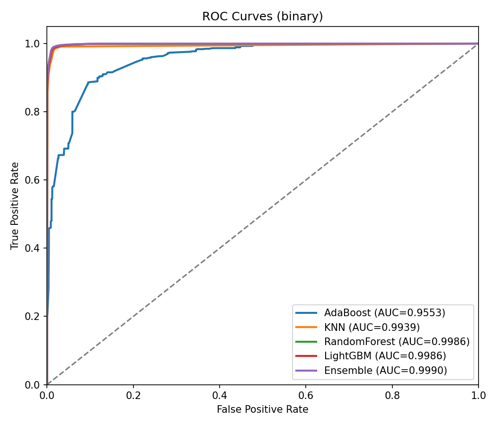
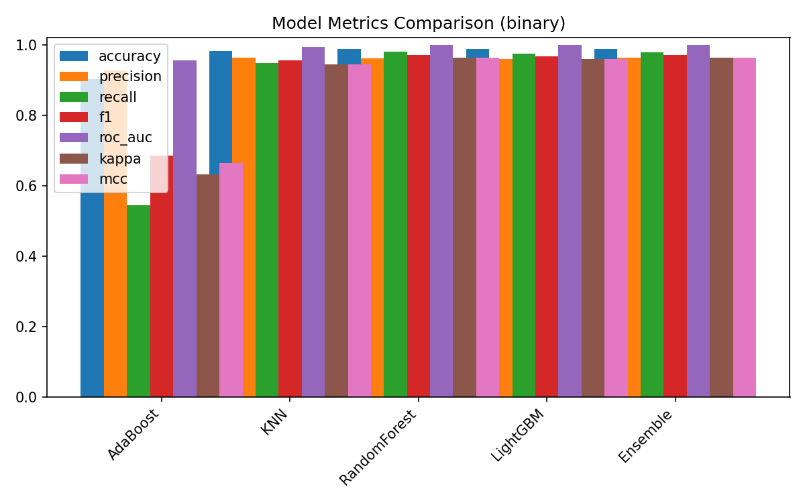
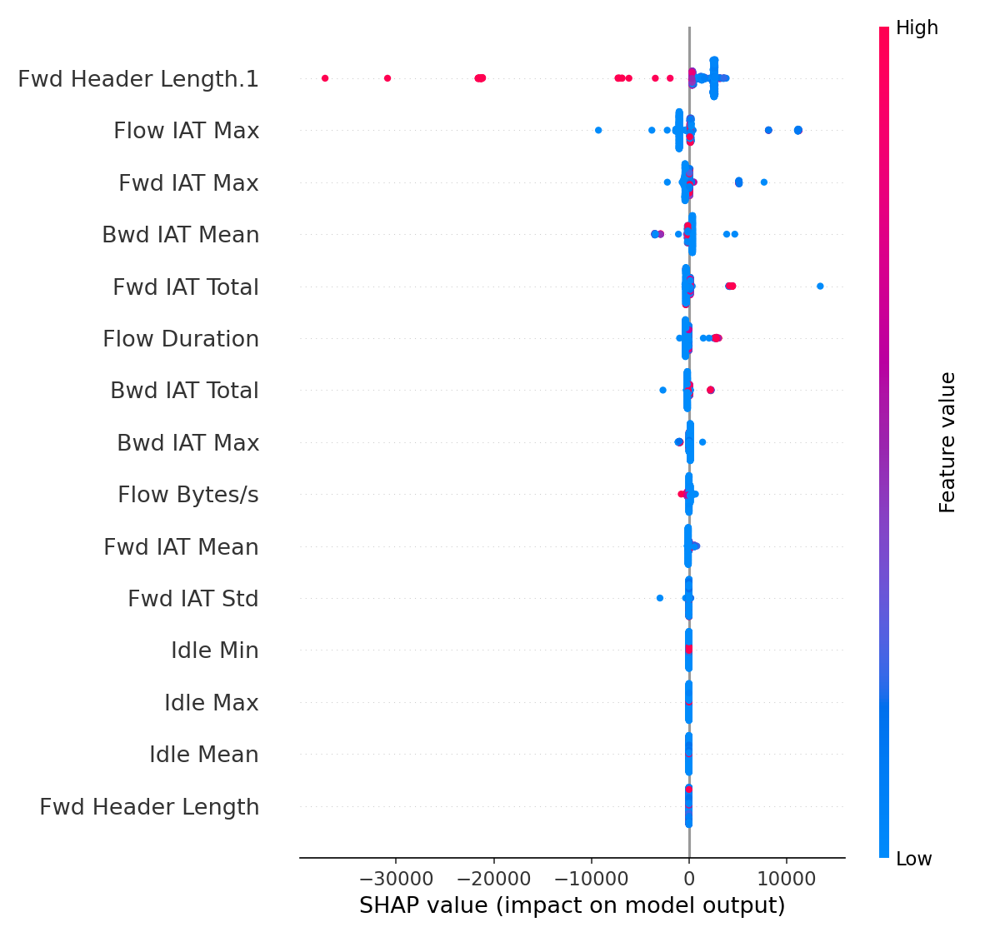
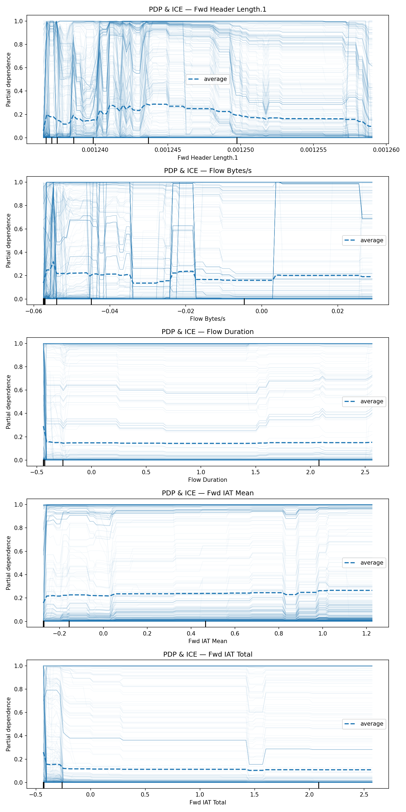

<div align="center">

# An Explainable Ensemble-Based Framework for Binary Network Intrusion Detection

**A stacking ensemble that classifies network flows as `BENIGN` or `ATTACK` — and explains why.**

`CICIDS2017` · `Stacking Ensemble` · `SHAP` · `PDP / ICE` · `Binary Classification`

</div>

---

## Overview

Network Intrusion Detection Systems built on machine learning reach high accuracy but behave as
black boxes. In security operations that is a real cost: a false positive disrupts legitimate
services, a false negative lets an intrusion through, and an analyst with no explanation has no
basis to act on either.

This framework addresses both halves of the problem at once:

- **Speed and robustness** — traffic is triaged as a **binary** decision (attack vs. benign)
  rather than sorted into attack families. Collapsing every malicious class into one positive
  class raises the effective sampling density of attack traffic and sidesteps the severe class
  imbalance that destabilises multi-class NIDS.
- **Accuracy through diversity** — four heterogeneous **Level-0** base learners spanning the
  bagging, boosting and instance-based paradigms are combined by a **Level-1** meta-learner that
  learns which predictor to trust under which traffic conditions.
- **Transparency by construction** — SHAP, PDP and ICE are part of the detection pipeline, not a
  post-hoc afterthought. Every decision carries a feature-level rationale.

### Contributions

| | |
|---|---|
| **(a)** | Speed up decision-making through a binary classification strategy |
| **(b)** | Enhance accuracy by combining models that fail in different ways |
| **(c)** | Achieve better overall performance via stacked generalisation |
| **(d)** | Increase trust and transparency by applying XAI techniques |
| **(e)** | Validate on CICIDS2017, a widely used NIDS benchmark |

---

## Architecture



### Why these four learners

Ensemble strength comes from **error diversity** — base learners that make *different kinds* of
mistakes. Each occupies a distinct learning paradigm:

| Base Learner | Paradigm | Objective | Role in intrusion detection |
|---|---|---|---|
| **Random Forest** | Bagging | Variance reduction | Stabilises predictions on high-dimensional traffic via bootstrap sampling and feature randomness |
| **LightGBM** | Gradient boosting | Bias reduction | Leaf-wise growth gives fast training and strong performance on large, high-dimensional flow data |
| **AdaBoost** | Adaptive boosting | Error reweighting | Emphasises misclassified samples, improving detection of hard-to-classify attacks |
| **KNN** | Instance-based | Geometric structure | Captures cluster-shaped attack patterns that rule-based splits miss |
| **Logistic Regression** *(Level-1)* | Stacked generalisation | Meta-learning & consensus | Weights Level-0 predictions by reliability, reducing overall error |

---

## Method

### Problem formulation

The traffic dataset is a set of flow instances

$$\mathcal{D} = \\{(x_i, y_i)\\}_{i=1}^{N}, \qquad x_i \in \mathbb{R}^d$$

Unlike multi-class formulations, all malicious flows map to a single `Attack` class:

$$y_i \in \\{0, 1\\} \qquad 0 = \texttt{BENIGN},\quad 1 = \texttt{ATTACK}$$

### Stacked generalisation

Each of the $K$ Level-0 learners produces a prediction $\hat{y}_k = f_k(x)$. The Level-1
meta-learner $G$ combines them:

$$y_{\text{ensemble}} = G\big(\hat{y}_1, \hat{y}_2, \ldots, \hat{y}_K\big)$$

The meta-learner assigns a coefficient $\beta_k$ to each base model according to its predictive
reliability:

$$y_{\text{ensemble}} = \beta_0 + \sum_{k=1}^{K} \beta_k \hat{y}_k + \epsilon$$

This lets the framework prioritise high-performing models while still drawing on auxiliary ones
to minimise variance and residual error. The learned $\beta$ values are written to
`images/metrics/meta_learner_coefficients.json` on every run, so the weighting is inspectable
rather than implied.

> **On the meta-learner.** The paper names this component *Linear Regression*. The
> implementation uses `LogisticRegression`, which applies exactly the linear weighting above —
> intercept $\beta_0$ plus one coefficient $\beta_k$ per base learner — through a logistic link.
> A $\{0,1\}$ target requires this: plain `LinearRegression` is not a classifier and cannot serve
> as a `StackingClassifier` final estimator.

### Feature consistency and robustness

Network traffic data is skewed, gap-ridden and full of degenerate columns. Four safeguards run
before any model sees data:

1. **Feature harmonisation** — only columns present in *every* capture file are retained, so each
   classifier operates in one consistent feature space across capture times.
2. **Noise reduction** — constant and duplicated columns are dropped. On CICIDS2017 this removes
   8 constant and 7 duplicated columns, including the notorious `Fwd Header Length.1`, a verbatim
   copy of `Fwd Header Length`.
3. **Variance filtering** — features with near-zero variance offer no discriminative power and
   are removed; survivors are ranked and the top `N_FEATURES` retained.
4. **Identifier removal** — `Flow ID`, `Source IP`, `Destination IP` and `Timestamp` are dropped
   from the feature space. Several of these leak host identity directly and would inflate results.

Selection and scaling are **fit on the training fold only**, so no test-set statistic can
influence which features are chosen or how they are normalised.

### Time-sensitive evaluation

CICIDS2017 has strong temporal structure — Monday is benign-only, and each attack family is
confined to the day it was staged. A naive random split scatters flows from the same attack burst
across train and test, which flatters the model. Three regimes are provided via `SPLIT_MODE`:

| Mode | Behaviour | Use it for |
|---|---|---|
| **`per_day`** *(default)* | Within each capture day, the earlier flows train and the later flows test | Chronological ordering with every attack family represented on both sides — the realistic operating picture |
| **`global_time`** | One chronological cut across the whole week | Worst case: Friday's Bot / PortScan / DDoS become **test-only**, measuring generalisation to *unseen attack families* |
| **`stratified`** | Random stratified split | Reproducing the originally published numbers below |

CICIDS2017 timestamps are inconsistent between files — `03/07/2017 08:55:58` in one,
`4/7/2017 8:54` in another, and afternoon captures written on a 12-hour clock with no meridiem
(`7/7/2017 3:30` meaning 15:30). The parser handles all three, and falls back to capture-day
ordering when a timestamp cannot be read.

### Integrated explainability

| Technique | Scope | What it answers |
|---|---|---|
| **SHAP** | Local | Which features pushed *this* flow toward Attack or Benign, and by how much |
| **PDP** | Global | How does predicted risk move as one feature varies across its whole range |
| **ICE** | Local + global | How much does that relationship vary between individual flows |
| **Sankey** | Global | Mean absolute SHAP flow from each feature into the Attack class |

Explainer choice follows model structure: `TreeExplainer` for Random Forest and LightGBM,
`PermutationExplainer` for KNN and AdaBoost (neither exposes tree structure), and
`KernelExplainer` for the stacked ensemble as a whole.

---

## Results

Reported on CICIDS2017, binary classification. **These figures come from the published
configuration** — reproduce them with `SPLIT_MODE = "stratified"`.

| Model | Accuracy | Precision | Recall | F1 | ROC-AUC | Kappa | MCC |
|---|---|---|---|---|---|---|---|
| AdaBoost | 0.9018 | 0.9260 | 0.5443 | 0.6856 | 0.9553 | 0.6320 | 0.6634 |
| KNN | 0.9823 | 0.9626 | 0.9468 | 0.9546 | 0.9939 | 0.9436 | 0.9437 |
| Random Forest | 0.9883 | 0.9610 | 0.9803 | 0.9705 | 0.9986 | 0.9632 | 0.9633 |
| LightGBM | 0.9868 | 0.9593 | 0.9741 | 0.9666 | 0.9986 | 0.9584 | 0.9584 |
| **Ensemble** | **0.9884** | **0.9627** | **0.9789** | **0.9707** | **0.9990** | **0.9635** | **0.9635** |

**Reading the table.** The base learners show clearly distinct behaviour. Random Forest and
LightGBM are the strongest individually, with low variance. KNN posts high recall and F1 but is
unstable across the other metrics. AdaBoost reaches reasonable accuracy but its recall of
**0.5443** is disqualifying on its own — in a NIDS, missing nearly half of all intrusions is the
expensive failure mode.

The ensemble's value is not a dramatic jump on any single metric — it is **operational
consistency**. It leads on accuracy, F1, ROC-AUC, Kappa and MCC simultaneously, without
sacrificing precision for recall or the reverse. For a detector facing constantly shifting
traffic, that stability matters more than a marginal win on one axis.

<div align="center">

| | |
|:--:|:--:|
|  |  |
| **ROC curves** — ensemble AUC 0.9990 | **Per-model metric comparison** |

</div>

### Global feature importance

SHAP attributions concentrate on **flow-timing and header** attributes: inter-arrival times, flow
duration and traffic volume dominate, with header-level fields close behind. That the influence
clusters in a small, coherent set of behavioural signals — rather than scattering across noise —
is itself evidence the model keys on genuine traffic behaviour. The top-ranked features overlap
heavily between Random Forest and LightGBM, indicating the ensemble members agree on *what
matters* even where they disagree on individual verdicts.

<div align="center">



</div>

### Effect analysis

PDP and ICE curves show several features relate **non-linearly** to intrusion probability:

- **Fwd Header Length.1** — non-monotonic: risk rises for moderate header lengths, then declines
  for longer ones. Wide ICE spread means its importance depends heavily on interactions.
- **Flow Bytes/s** — globally weak and non-linear, but individual ICE curves show abrupt
  transitions, evidence of threshold-based decision rules.
- **Flow Duration** — nearly flat globally, yet ICE curves step sharply per instance: it
  contributes to *local* decision boundaries rather than global ranking.
- **Fwd IAT Mean** — gradually increasing: larger inter-packet delays marginally raise predicted
  risk, with a dip at mid-range marking a behavioural transition zone.
- **Fwd IAT Total** — sharp decline at low values then a long plateau: very small cumulative
  inter-arrival times associate strongly with attack traffic.

<div align="center">



</div>

---

## Repository layout

```
.
├── CICIDS-2017/
│   ├── ensemble.py              ← the framework: full pipeline end to end
│   ├── cicids_db/               ← dataset goes here (not tracked)
│   ├── images/                  ← all generated output
│   │   ├── metrics/             ── confusion matrices, per-model + summary tables,
│   │   │                           metrics_summary.csv, meta_learner_coefficients.json
│   │   ├── roc/                 ── ROC curves for all five models
│   │   ├── shap/                ── SHAP summary + bar plots, per model and ensemble
│   │   ├── pdp/                 ── combined PDP & ICE panel
│   │   ├── sankey/              ── feature → Attack SHAP flow (interactive HTML)
│   │   ├── instance/            ── per-instance probability comparison
│   │   └── models/              ── serialised models + scaler (not tracked)
│   └── *_final.py               ← per-model baseline scripts (see Attribution)
├── NSL-KDD/                     ← baseline scripts, other dataset (upstream)
├── RoEduNet-SIMARGL2021/        ← baseline scripts, other dataset (upstream)
├── Framework/                   ← shared preprocessing + SHAP/LIME helpers (upstream)
├── RF_LIME_SHAP.ipynb           ← exploratory notebook (upstream)
└── dev trial/t1/                ← earlier experimental run outputs
```

---

## Getting started

### 1. Install

```bash
pip install numpy pandas scikit-learn lightgbm shap joblib matplotlib plotly
```

Developed against `numpy 2.2` · `pandas 2.3` · `scikit-learn 1.7` · `lightgbm 4.6` · `shap 0.49`.

### 2. Get the dataset

CICIDS2017 is **not included** — the eight CSVs total roughly 1.3 GB, far past GitHub's limits.
Download them from the Canadian Institute for Cybersecurity:

**<https://www.unb.ca/cic/datasets/ids-2017.html>**

Place the `GeneratedLabelledFlows` CSVs in `CICIDS-2017/cicids_db/`:

```
CICIDS-2017/cicids_db/
├── Monday-WorkingHours.pcap_ISCX.csv
├── Tuesday-WorkingHours.pcap_ISCX.csv
├── Wednesday-workingHours.pcap_ISCX.csv
├── Thursday-WorkingHours-Morning-WebAttacks.pcap_ISCX.csv
├── Thursday-WorkingHours-Afternoon-Infilteration.pcap_ISCX.csv
├── Friday-WorkingHours-Morning.pcap_ISCX.csv
├── Friday-WorkingHours-Afternoon-PortScan.pcap_ISCX.csv
└── Friday-WorkingHours-Afternoon-DDos.pcap_ISCX.csv
```

Filenames matter — the chronological split reads capture-day ordering from them.

### 3. Run

```bash
cd CICIDS-2017
python ensemble.py
```

Everything lands in `CICIDS-2017/images/`. Trained models are also excluded from version control:
the fitted ensemble alone is ~1.6 GB. Re-running regenerates them.

---

## Configuration

All knobs sit at the top of `ensemble.py`.

| Constant | Default | Meaning |
|---|---|---|
| `SPLIT_MODE` | `"per_day"` | Evaluation regime — `per_day`, `global_time` or `stratified` |
| `VARIANCE_BASIS` | `"raw"` | Scale on which variance is measured — `raw` or `minmax` |
| `N_FEATURES` | `15` | Features retained after variance selection |
| `TOP_PDP` | `5` | Features plotted in the PDP/ICE panel |
| `TEST_SIZE` | `0.2` | Test fraction |
| `RANDOM_STATE` | `42` | Seed |
| `SHAP_BACKGROUND` / `SHAP_DATA` | `100` / `200` | Tree-explainer background and explained rows |
| `PERM_EXPLAINER_SAMPLES` | `200` | Permutation-explainer budget (KNN, AdaBoost) |
| `ENSEMBLE_BG` / `ENSEMBLE_DATA` / `ENSEMBLE_NSAMPLES` | `50` / `150` / `200` | Kernel-explainer budgets |

**To reproduce the published Table 2 exactly**, set:

```python
SPLIT_MODE     = "stratified"
VARIANCE_BASIS = "raw"
```

and remove `("ada", models["AdaBoost"])` from the `StackingClassifier` estimator list — the
published run stacked three learners, not four. See the note below.

---

## Implementation notes

Points where the code and the write-up need to be read together. Documented openly so results
stay reproducible and interpretable.

1. **AdaBoost is a stacked base learner here.** Table 1 and Fig. 1 present AdaBoost as a Level-0
   learner, and the diversity argument depends on it — but the run that produced Table 2 stacked
   only Random Forest, LightGBM and KNN. This implementation includes all four, matching the
   described architecture. Because AdaBoost's standalone recall is 0.5443, expect the ensemble
   metrics to shift; **the numbers in Table 2 correspond to the three-learner stack** and require
   a re-run to update.

2. **The meta-learner is `LogisticRegression`**, not linear regression — see the note in
   *Stacked generalisation* above.

3. **`SPLIT_MODE` now defaults to a genuinely time-sensitive split.** The published numbers came
   from a random stratified split. A chronological split is the stricter and more realistic
   evaluation, so it is the default; `stratified` remains available for reproduction.

4. **Variance is measured on raw values by default**, which reproduces the published feature set
   but is scale-dependent — microsecond-scale timing columns carry enormous raw variance purely
   because of their units, which is why timing features dominate Fig. 3. Set
   `VARIANCE_BASIS = "minmax"` for a unit-free comparison. Variance is deliberately *not*
   measured after `StandardScaler`, which would force every variance to exactly 1.0 and make the
   ranking degenerate.

5. **Selection and scaling are fit on the training fold only.** The published pipeline fit the
   scaler before splitting, letting test-set statistics influence normalisation. The effect is
   small for `StandardScaler`, but the leak is real and has been closed.

6. **Prose vs. table in the write-up.** Section 4.1 quotes ensemble accuracy `0.9881` / F1
   `0.9701` and Section 4.2 quotes ROC-AUC `0.9985`. The verified run output is **`0.9884`**,
   **`0.9707`** and **`0.9990`** — Table 2 is correct and the prose figures are stale.

---

## Dataset notes

Practical issues in CICIDS2017 that this pipeline handles, worth knowing if you extend it:

- **`Thursday-WorkingHours-Morning-WebAttacks.csv` contains 288,602 entirely blank rows** —
  roughly 63% of the file. Left unhandled these become `NaN` labels; since the labeller treats
  "not BENIGN" as attack, they would silently poison the positive class. They are dropped by the
  all-NaN filter.
- **Non-UTF-8 bytes** appear in web-attack labels (`Web Attack \x96 Brute Force`), so CSV reads
  fall back to `ISO-8859-1`.
- **`Fwd Header Length` is duplicated** as `Fwd Header Length.1`. Noise reduction removes it.
- **Infinite values** in rate columns (`Flow Bytes/s`, `Flow Packets/s`) arise from zero-duration
  flows; they are converted to `NaN` and dropped.

---

## Attribution

The per-dataset baseline scripts — `CICIDS-2017/*_final.py`, `NSL-KDD/`,
`RoEduNet-SIMARGL2021/`, `Framework/` and `RF_LIME_SHAP.ipynb` — originate from the
**[ogarreche/XAI_NIDS](https://github.com/ogarreche/XAI_NIDS)** research repository and remain the
work of their original authors.

The contribution in this repository is the **binary stacking-ensemble framework** —
`CICIDS-2017/ensemble.py` — together with its explainability pipeline, generated figures and
results.

## References

Core works underpinning the framework:

- Sharafaldin, I., Lashkari, A.H., Ghorbani, A.A. — *Toward generating a new dataset for network
  intrusion detection and intrusion prevention systems*, ICISSP (2018) — **CICIDS2017**
- Lundberg, S.M., Lee, S.I. — *A unified approach to interpreting model predictions*, NeurIPS
  (2017) — **SHAP**
- Ke, G. et al. — *LightGBM: A highly efficient gradient boosting decision tree*, NeurIPS (2017)
- Goldstein, A. et al. — *Peeking inside the black box: visualizing statistical learning with
  plots of individual conditional expectation*, JCGS 24(1) (2015) — **ICE**
- Ring, M. et al. — *A survey of network-based intrusion detection data sets*, Computers &
  Security 86 (2019)
